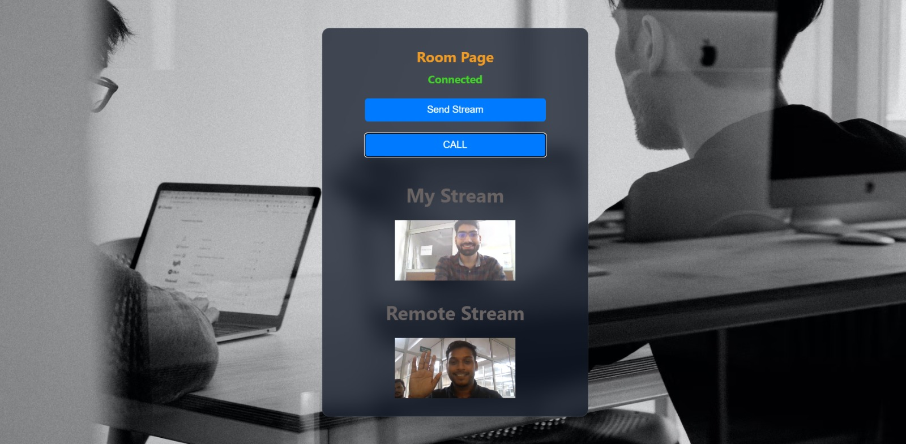

# FaceTime App

## Introduction

This is a simple video call app that allows users to connect with others using their email and a room code.

## Tech Stack

- **Frontend**: React.js
- **Backend**: Node.js, Socket.io, WebRTC

## Usage

1. Enter a room code and your email.
2. Start a video call with others in the same room.

That's it! You're now ready to make video calls with your friends and colleagues.
